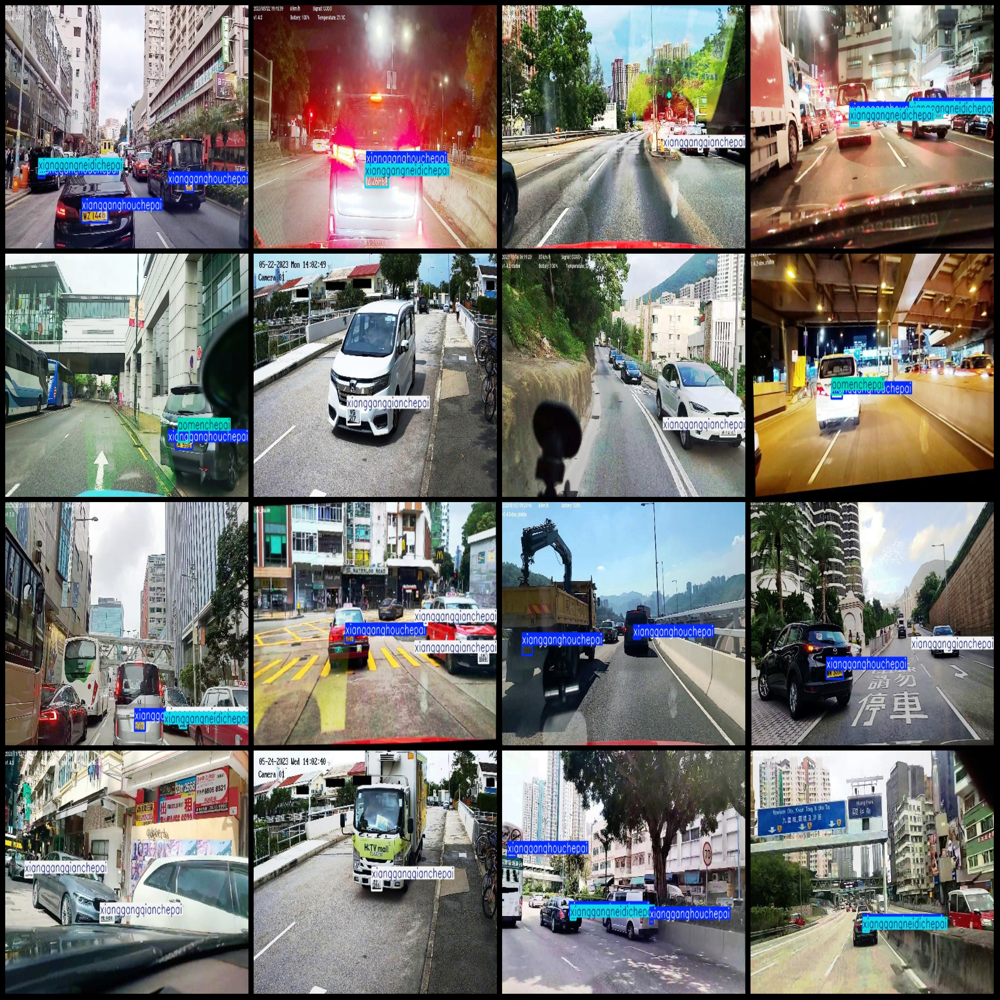
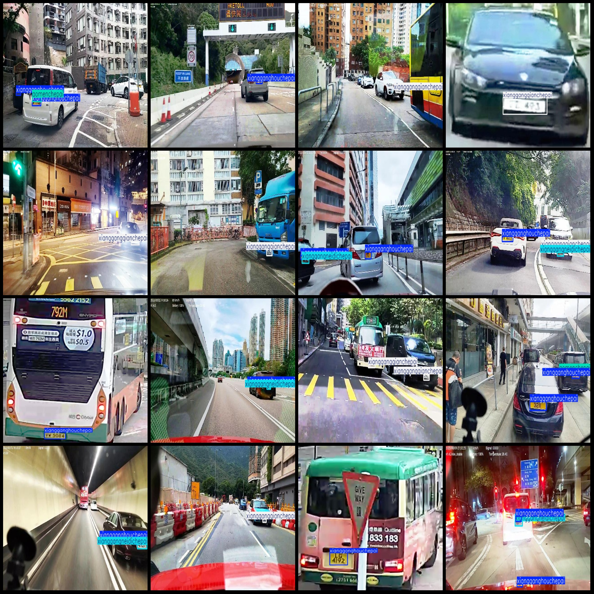
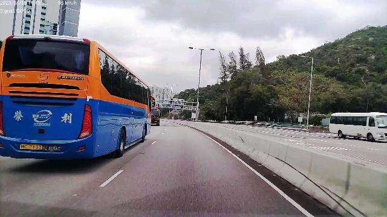
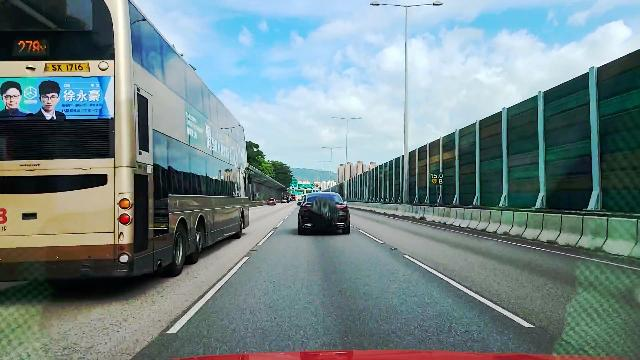
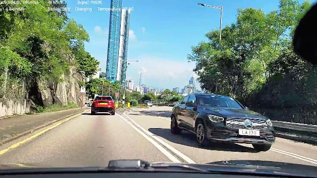

# Traffic Smart Vehicle License Plate Detection Data Set for Hong Kong and Macao - VOC+YOLO Format with 4 Categories

Please note that the overall clarity of the dataset images is not very clear. Specifically, please refer to the image introduction for details.

The dataset format: Pascal VOC format + YOLO format (without the split path's txt file, only containing jpg images as well as the corresponding VOC format xml files and YOLO format txt files).

Number of images (jpg files): 4167

Number of annotations (xml files): 4167

Number of annotations (txt files): 4167

Number of annotation categories: 4

Annotation category names (note that the order of labels in the YOLO format does not correspond with this, but rather, according to the "labels" folder's "classes.txt" file): ["Macau license plate", 
"Hong Kong rear license plate", "Hong Kong mainland license plate", "Hong Kong front license plate"]

Corresponding Chinese category names: ["Macau License Plate", "Hong Kong Rear License Plate", "Hong Kong Mainland License Plate", "Hong Kong Front License Plate"]

Box count per category:
- Macau License Plate box count = 632
- Hong Kong Rear License Plate box count = 3561
- Hong Kong Mainland License Plate box count = 1383
- Hong Kong Front License Plate box count = 2028
Total box count: 7604

Box count per category per image:
- Macau License Plate image count = 561
- Hong Kong Rear License Plate image count = 2592
- Hong Kong Mainland License Plate image count = 1328
- Hong Kong Front License Plate image count = 1803

Image resolution: 640x360

Annotation tool used: labelImg

Annotation rules: draw a rectangle around the category

Important notes: The dataset has not been divided into training, validation, or test sets, so you will need to do so yourself.

Special declaration: This dataset does not guarantee any precision on the models trained or the weights files.

Image previews:

Annotation examples:
(Note that the overall clarity of the dataset images is not very clear. Specifically, please refer to the image introduction for details.)
## Images

Here is a pay link on Stripe ( https://buy.stripe.com/3cs8yP7sY87d0vu9AB ). Please contact me lonlonago@foxmail.com after funding $89, and I will send you a complete data files , thank you!

